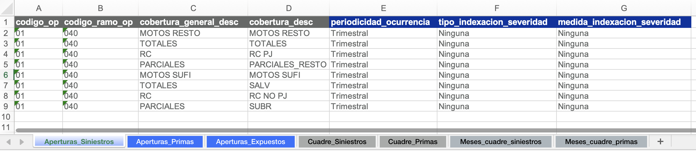
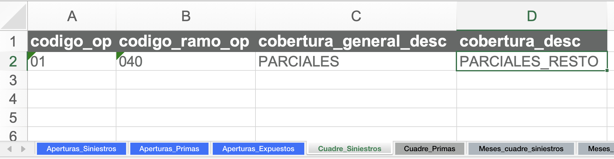

# El archivo segmentación

Este es un archivo de Excel con tres objetivos:

1. **Definir las aperturas** de siniestros, primas, y expuestos para el análisis.
2. **Parametrizar el cuadre contable** contra SAP (opcional).
3. **Almacenar tablas de aperturas** para cargar en _queries_ de Teradata (opcional).

!!! example "Ejemplos"
    Consulte ejemplos reales de [archivos de segmentación utilizados para los cierres contables](https://github.com/sebastobone/app-analisis-siniestralidad/tree/main/data/).

## Definir aperturas

### ¿Qué es una apertura?

Una **apertura** es un nivel de desagregación del producto a analizar.

!!! example "Ejemplo"
    En un seguro de salud, podría analizarse cada cobertura por separado (laboratorios, diagnósticos, cirugías) o agruparlas en categorías con comportamientos similares. En ese caso, decimos que estamos **"aperturando"** por cobertura.

### Tablas de aperturas

En el archivo de segmentación, cree las siguientes hojas con sus respectivas tablas de aperturas:

- **Apertura_Siniestros**
- **Apertura_Primas**
- **Apertura_Expuestos**

!!! warning "Advertencia"
    Cada tabla debe incluir obligatoriamente las columnas:

    - **codigo_op** (código de la compañía)
    - **codigo_ramo_op** (código del ramo)

    Estas columnas son necesarias para realizar las comparaciones contra SAP.

### Propiedades de las aperturas

#### Aperturas de siniestros

En la hoja **Apertura_Siniestros**, para cada apertura se debe definir:

1. **Periodicidad de ocurrencia**: Granularidad del triángulo y del entremés. Valores disponibles:

    - Mensual
    - Trimestral
    - Trimestral (Feb - Abr | May - Jul | Ago - Oct | Nov - Ene)
    - Trimestral (Mar - May | Jun - Ago | Sep - Nov | Dic - Feb)
    - Semestral
    - Semestral (Feb - Jul | Ago - Ene)
    - Semestral (Mar - Ago | Sep - Feb)
    - Semestral (Abr - Sep | Oct - Mar)
    - Semestral (May - Oct | Nov - Abr)
    - Semestral (Jun - Nov | Dic - May)
    - Anual
    - Anual (Feb - Ene)
    - Anual (Mar - Feb)
    - Anual (Abr - Mar)
    - Anual (May - Abr)
    - Anual (Jun - May)
    - Anual (Jul - Jun)
    - Anual (Ago - Jul)
    - Anual (Sep - Ago)
    - Anual (Oct - Sep)
    - Anual (Nov - Oct)
    - Anual (Dic - Nov)

2. **Tipo de indexación de la severidad**: Metodología de indexación que se utilizará para calcular la severidad. Puede tomar tres valores:

    - Ninguna
    - Por fecha de ocurrencia
    - Por fecha de movimiento

3. **Medida de indexación de la severidad**: Nombre del indicador a usar para la indexación (si aplica).

!!! example "Ejemplo"
    

#### Aperturas de primas y expuestos

En las hojas **Aperturas_Primas** y **Aperturas_Expuestos**, se debe incluir una columna adicional: **apertura_redundante** (VERDADERO / FALSO).

Esta columna indica si una apertura **contiene información ya incluida en otras aperturas**.

##### ¿Qué es una apertura redundante?

Una apertura es redundante cuando su información puede obtenerse sumando otras aperturas.
Esto es clave para evitar:

- Doble conteo
- Errores en controles
- Diferencias artificiales frente a SAP o análisis históricos

!!! example "Ejemplo"
    Supongamos un análisis de autos con las siguientes aperturas:

    - Cobertura: "RC" y "Daños"
    - Tipo de negocio: "Individual", "Colectivo", "Financieras"

    - Los siniestros se analizan por ambas dimensiones
    - Las primas sólo por tipo de negocio  
    - La cobertura RC se analiza de forma agregada ("Todos")  

    La tabla en **Apertura_Primas** sería:

    |codigo_op|codigo_ramo_op|tipo_negocio|apertura_redundante|
    |-|-|-|-|
    |01|040|Individual|FALSO|
    |01|040|Colectivo|FALSO|
    |01|040|Financieras|FALSO|
    |01|040|Todos|VERDADERO|

    La fila **RC - Todos** es redundante porque equivale a la suma de las demás aperturas.

## Parametrizar el cuadre contable

!!! tip
    Si no realizará cuadre contable, puede omitir esta sección.

### Aperturas y periodos para repartir diferencias

Cree dos hojas:

1. **Cuadre_Siniestros**
2. **Cuadre_Primas**

En cada una incluya una tabla con:

- Las aperturas.
- La fecha de ocurrencia (sólo para **Cuadre_Siniestros**).
- Todos los meses de movimiento esperados.
- Columnas para especificar el peso de repartición de cada una de las cantidades en cada apertura-ocurrencia.

Si una cantidad no debe cuadrarse en un periodo contable determinado, deje el valor en **0** para todas las aperturas y fechas de ocurrencia correspondientes.

Si el valor de la ponderación suma más que 1 para un periodo contable, el sistema lo normalizará automáticamente.

!!! example "Ejemplo"
    Supongamos que tenemos una diferencia de $100 para el periodo contable 202412 y queremos repartirla por igual en las ocurrencias de 202411 y 202412. Adicionalmente, queremos que 1/3 se asigne a la "apertura_1", 1/2 a la "apertura_2", y 1/3 a la "apertura_3". En ese caso, la hoja se podría parametrizar así:

    

## Tablas para cargar en _queries_

!!! tip
    Si no va a extraer información de Teradata, omita esta sección.

Las tablas y el formato requerido se describen en la [guía de construcción de _queries_](queries.md#desde-el-archivo-segmentacion-camino-complejo).
