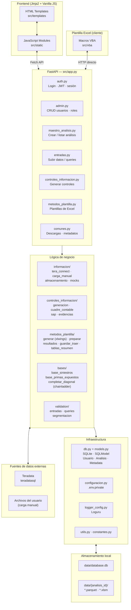
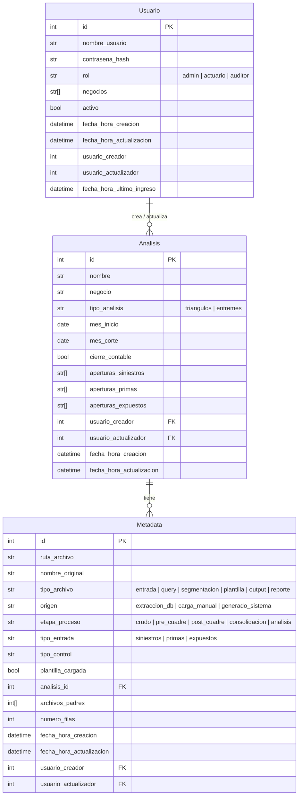
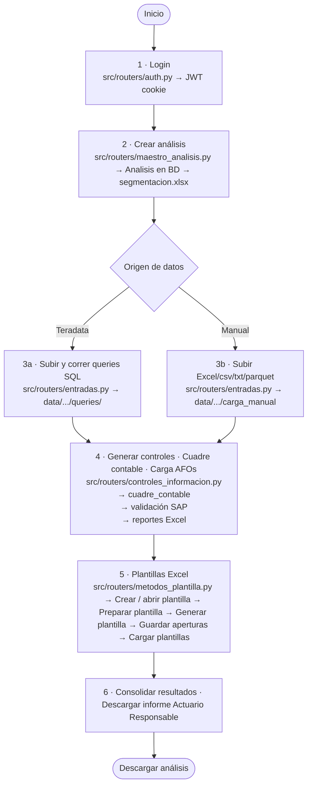
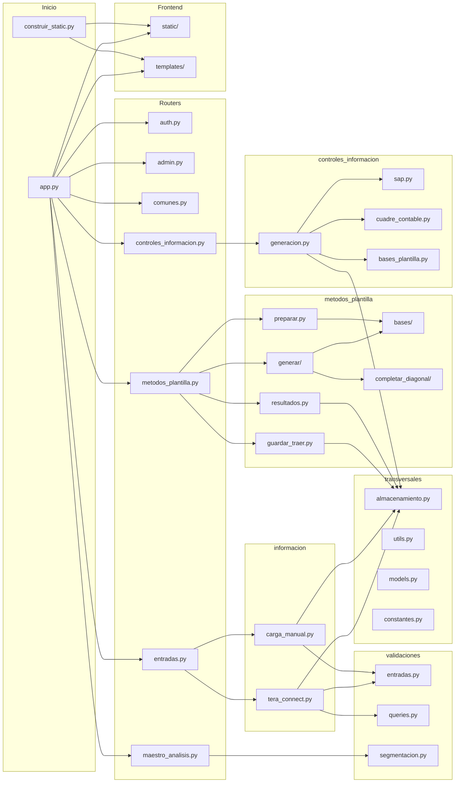

<!--markdownlint-disable MD007-->

# Arquitectura

Visión general del stack tecnológico y los componentes principales de la aplicación.

## Capas de la aplicación

## Backend

- **Framework:** [FastAPI](https://fastapi.tiangolo.com/) (Python), punto de entrada `src/app.py`.
- **Routers:** `auth.py` (login, JWT, sesión), `admin.py` (CRUD de usuarios y roles), `maestro_analisis.py` (crear/listar análisis), `entradas.py` (subir datos y queries), `controles_informacion.py` (generar controles), `metodos_plantilla.py` (plantillas de Excel), `comunes.py` (descargas y metadatos).
- **Lógica de negocio**, organizada por dominio: `informacion/` (extracción Teradata, carga manual, almacenamiento), `controles_informacion/` (generación de controles, cuadre contable, SAP, evidencias), `metodos_plantilla/` (generar, preparar, resultados, guardar/traer, tablas resumen), `bases/` (bases de siniestros/primas/expuestos, completar diagonal con `chainladder`), `validation/` (entradas, queries, segmentación).
- **Procesamiento de datos:** [Polars](https://pola.rs/), usando `LazyFrame` para optimizar los pipelines internos.
- **Verificación de tipos:** [`zuban`](https://github.com/zubanls/zuban).
- **Logging:** [Loguru](https://github.com/Delgan/loguru), configurado en `logger_config.py`.
- **Notificaciones en tiempo real:** *Server-Sent Events (SSE)*, soportado nativamente por FastAPI.

## Frontend

- **Renderizado del lado del servidor:** plantillas [Jinja2](https://jinja.palletsprojects.com/) en `src/templates`.
- **Interactividad:** módulos de JavaScript "vanilla" (sin framework) en `src/static`, con verificación de tipos propia (ver changelog v1.2.0) que consumen la API vía `fetch`.
- `construir_static.py` construye/empaqueta los archivos estáticos.

## Cliente de plantilla Excel (VBA)

- Además del frontend web, las **macros VBA** de la plantilla de Excel actúan como un segundo cliente de la API: hacen peticiones HTTP directamente al backend (por ejemplo, para guardar o traer estimaciones), autenticadas con un token único por plantilla y usuario.
- Este es el mecanismo de interacción en **tiempo de ejecución**, una vez el usuario ya tiene el archivo `.xlsm` — distinto de cómo se genera el archivo en primer lugar (ver [Plantillas de Excel](#plantillas-de-excel)).

## Almacenamiento

- **Base de datos:** SQLite (`data/database.db`), con [SQLModel](https://sqlmodel.tiangolo.com/) como ORM. Tablas principales: `Usuario`, `Analisis`, `Metadata`.
- **Archivos por análisis:** cada análisis tiene su propia carpeta `data/{analisis_id}/`, con archivos `.parquet` (datos procesados) y `.xlsm` (plantillas de Excel).
- Copias de seguridad de `data/` mediante el script `db_backup.py`.

### Modelo de datos

## Plantillas de Excel

Las estimaciones (triángulos y entremés) se realizan en plantillas de Excel con macros **VBA**. El backend y la plantilla interactúan en dos momentos distintos:

- **Descarga del archivo:** al descargar una plantilla, `routers/comunes` usa [`xlwings`](https://www.xlwings.org/) para incrustar el token autenticador en el archivo. Esta es la razón por la que el servidor de producción [corre sobre una máquina Windows con Excel instalado](despliegue.md#servidor).
- **Interacción en tiempo de ejecución:** una vez el usuario tiene el `.xlsm`, el backend deja de intervenir vía `xlwings` — son las [macros VBA las que llaman a la API directamente por HTTP](#cliente-de-plantilla-excel-vba).

Los módulos VBA están versionados en `src/vba/` y se sincronizan con `plantilla.xlsm` mediante el script `actualizar_vba.py`.

## Integraciones externas

- **Teradata:** fuente de los datos de siniestros, primas y expuestos, vía el driver [`teradatasql`](https://pypi.org/project/teradatasql/). Las credenciales se configuran desde la interfaz web (no desde variables de entorno), salvo para [ejecutar pruebas localmente](entorno.md#configurar-variables-de-entorno).

## Autenticación y roles

- Acceso mediante usuario y contraseña; la sesión se maneja con un **JWT en cookie** (`src/routers/auth.py`).
- Roles definidos en el modelo `Usuario`: **admin** (gestión de usuarios y accesos), **actuario** (usuario de negocio, crea y opera análisis) y **auditor** (solo lectura, ver la [guía para auditores](../auditores/inicio.md)).
- Cada usuario tiene además una lista de `negocios` a los que tiene acceso.

## Flujo de trabajo del usuario

## Estructura del repositorio

