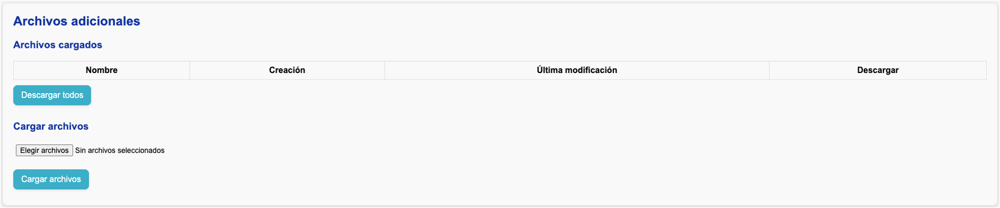

# Cargar archivos adicionales

En caso de que realice estimaciones por fuera de las plantillas y desee cargar estos archivos en el servidor, cárguelos en la sección **Archivos adicionales**.

!!! tip
    Se recomienda cargar estos archivos adicionales para facilitar los ejercicios de auditoría y unificar todo el análisis en una sola fuente.
