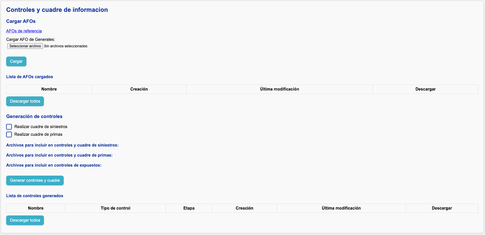
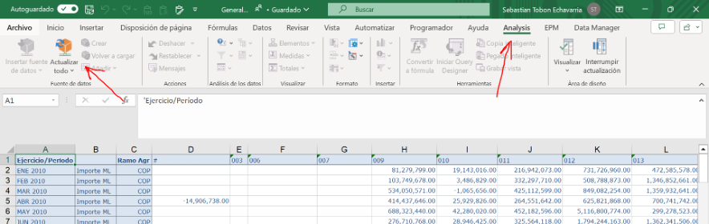
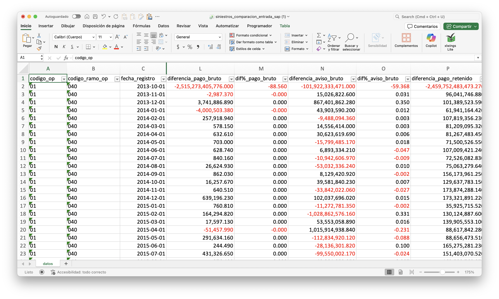
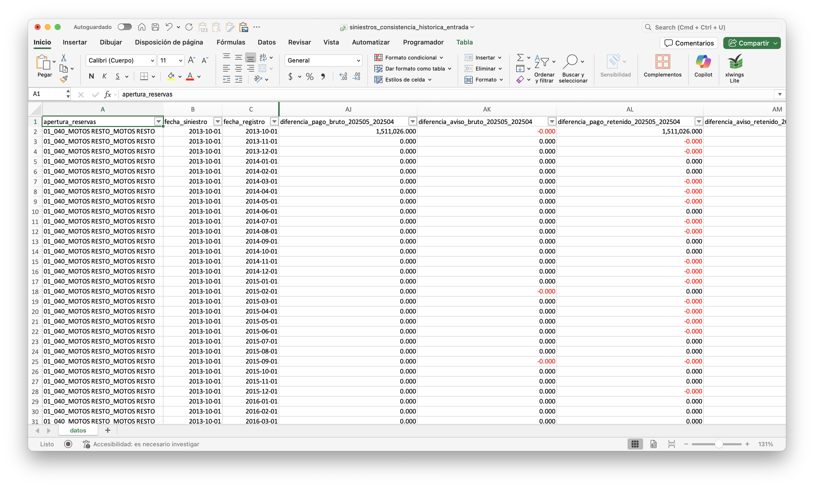
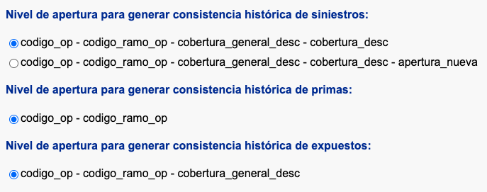
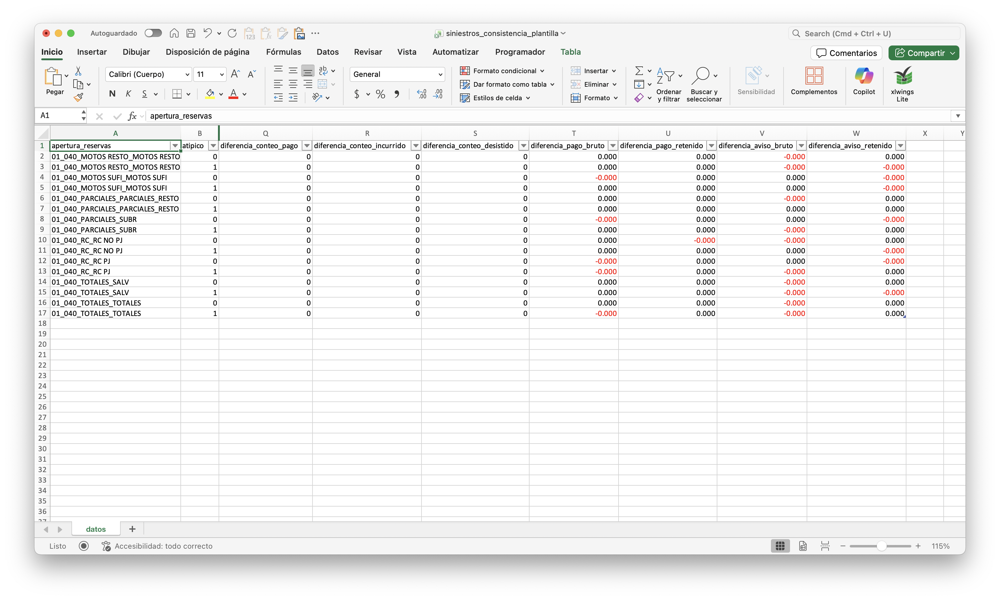
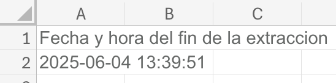
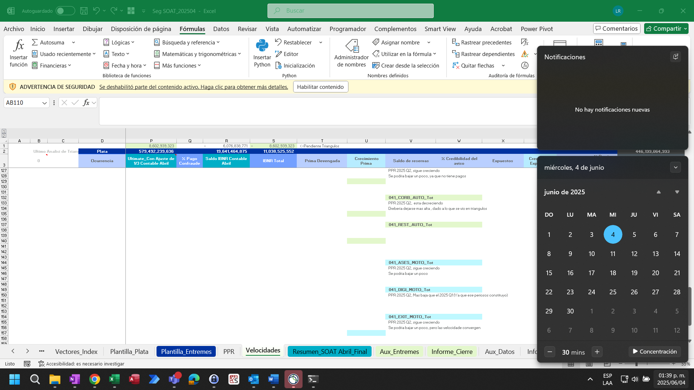

# Generar controles de información y cuadrar contablemente

En la página de análisis encontrará la siguiente sección:

## Los archivos AFOs

Los "AFOs" son archivos de Excel que, mediante el complemento **Analysis For Office (AFO)**, muestran las cifras contables de cada mes para:

- **Primas**
- **Pagos de siniestros**
- **Movimientos de reserva de aviso**

Según las aperturas que haya definido en el [archivo de segmentación](../config/segmentacion.md), la aplicación le pedirá cargar los AFOs correspondientes.

!!! info "AFOs de referencia"
    En [**este enlace**](https://suramericana-my.sharepoint.com/:f:/g/personal/sebastiantobon_sura_com_co/ErrqzjH-aIRMsAgGij4ptPABWbknTTpJMxfBjFJPU6YIWQ?e=1dPTF6) encontrará los archivos AFO suministrados por Modelación Técnica para cada una de las compañías.

### Actualización de AFOs

Si tiene instalado el complemento **Analysis For Office**, puede actualizar los AFOs manualmente usando las funciones mostradas en la siguiente imagen:

## Cuadre contable

En la pantalla verá dos casillas de verificación (_checkboxes_) para indicar si desea realizar el **cuadre contable** de **siniestros y primas**. Si las activa, el sistema leerá y validará la parametrización de su [archivo de segmentación](../config/segmentacion.md#parametrizar-el-cuadre-contable).

### Repartición de diferencias contables

En la parte inferior, bajo los títulos **Archivos para incluir en controles y cuadre de siniestros, primas, y expuestos**, debe seleccionar qué archivos (ya sea de extracción o carga manual) se compararán contra SAP.

- El sistema calcula las diferencias a nivel de ramo-compañía y las reparte en las aperturas y ocurrencias definidas en las hojas **Cuadre_Siniestros**, **Cuadre_Primas** y **Meses_cuadre_siniestros** del [archivo de segmentación](../config/segmentacion.md#aperturas-para-repartir-diferencias).
- Si especificó más de una apertura, la diferencia se reparte proporcionalmente a la participación de cada apertura en la cifra contable histórica.

!!! info
    Cada vez que extrae o carga un nuevo archivo de siniestros, primas, o expuestos, las listas de archivos disponibles se actualizan automáticamente.

!!! example "Ejemplo"
    Supongamos que el ramo **040** tiene una diferencia de $100 en el **pago bruto** para agosto 2025. Especificamos dos aperturas para repartir la diferencia:

    - **"Autos"**, con $300,000 pagados en toda la historia.
    - **"Motos"**, con $100,000 pagados en toda la historia.
    
    Para el cuadre contable, se asignarán $75 a "Autos" y $25 a "Motos" para agosto 2025.

## Controles de información

Si activa el cuadre contable, los controles se ejecutan **dos veces**:

1. Con la información **antes del cuadre**.
2. Con la información **después del cuadre**.

### Comparación entre las cifras de Teradata y SAP

Esta comparación solamente se realiza para **primas y siniestros**. Se compara cada cantidad en cada periodo contable a nivel de **ramo-compañía** (apertura máxima disponible desde SAP). La diferencia se calcula en valor absoluto y en porcentaje, tomando SAP como referencia.

#### Umbrales aceptados

Por defecto, el sistema alerta si detecta una diferencia **mayor al 5%** en alguna cifra para el **mes de corte**.

!!! note "Nota"
    Este umbral puede variar según las [características de cada negocio](../cierre/particularidades.md).

### Consistencia histórica

El sistema compara la extracción actual contra la de meses anteriores, tanto para Teradata como para SAP, con el objetivo de detectar cambios relevantes en la información.

Para Teradata, la validación se realiza considerando:

- El nivel de aperturas seleccionado en la interfaz web
- El periodo de ocurrencia
- El periodo de movimiento

Esto permite identificar variaciones en los montos totales y cambios en las fechas de ocurrencia o movimiento.

#### Manejo de diferentes niveles de granularidad

Si los análisis históricos fueron generados con un nivel de aperturas distinto al actual, la interfaz mostrará opciones para definir cómo construir la evidencia.

Las reglas son:

- Si un análisis histórico tiene una **granularidad menor** (más agregado) que la seleccionada, **no se incluye** en la evidencia.
- Si tiene una **granularidad mayor** (más detallada), se agrupa al nivel seleccionado y **sí se incluye**.

!!! example "Ejemplo"
    Supongamos que los análisis históricos se hicieron con las aperturas **codigo_op - codigo_ramo_op - cobertura_general_desc - cobertura_desc**, y en el análisis actual se agregó una nueva apertura para siniestros.

    En este caso, la interfaz permitirá elegir entre distintos niveles de granularidad para generar la evidencia:

    

### Consistencia entre información de entrada y la información que viaja a las plantillas

El sistema compara la información de [los archivos finales de siniestros, primas, y expuestos](plantilla/consolidacion.md#consolidacion-de-informacion) con la información final que viaja a la plantilla.

### Evidencias de extracción

El sistema guarda dos evidencias del momento de extracción:

1. **El archivo de segmentación utilizado**, con una hoja extra que incluye la fecha y hora de generación de controles.

    

2. **Un pantallazo** con la fecha y hora de generación de controles.

    
