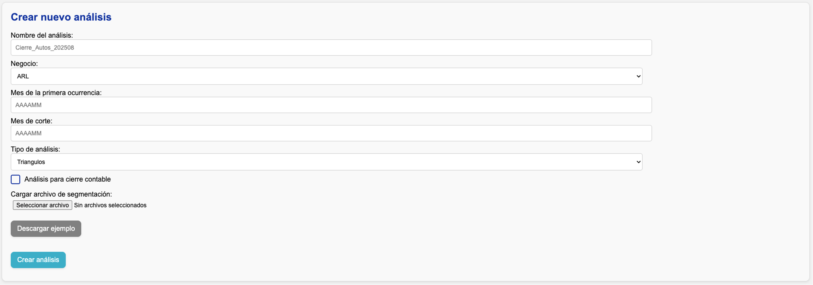

# Crear un análisis

En la interfaz web, verá la siguiente sección:

## Pasos

!!! tip "¿Retomando un análisis que ya comenzó?"
    Baje a la sección **Retomar análisis** y haga click sobre el análisis que desea retomar.

1. Llene el campo **Nombre del análisis**.

2. En el campo **Negocio**, seleccione el negocio que desea analizar.

    !!! info "Negocios especiales"
        Hay dos negocios especiales: **"Demo"** y **"Custom"**.

        - **"Demo"** permite hacer ejercicios de familiarización con información ficticia.
        - **"Custom"** permite hacer un ejercicio para un negocio diferente a las líneas tradicionales.

3. En **Mes de la primera ocurrencia**, escriba (en formato **YYYYMM**) el mes de la primera ocurrencia de los triángulos o entremés.

    - Si en la información de siniestros, primas, o expuestos se encuentran meses anteriores a este, las cifras se agruparán en este primer mes con el objetivo de garantizar una correcta comparación contra SAP.

4. En **Mes de corte**, escriba (en formato **YYYYMM**) el mes de corte de la información.
5. En **Tipo de análisis**, elija entre **Triángulos** o **Entremés**.

6. En **Cargar archivo de segmentación**, cargue el [archivo de segmentación](../config/segmentacion.md) que construyó. Si no tiene uno, presione el botón **Descargar ejemplo** para obtener un archivo guía.

7. Use la casilla de verificación para marcar si el análisis hará parte de un ejercicio de **cierre contable**.

8. Presione el botón **Crear análisis**. Será redirigido a la página donde hará el análisis.

## Validaciones sobre el archivo de segmentación

Al presionar **Crear análisis**, la aplicación valida automáticamente:

- Que existan todas las hojas de aperturas.
- Que existan todas las columnas necesarias en las hojas de aperturas.
- Que no haya aperturas duplicadas.
- Que no hayan valores nulos en ninguna tabla.
- Que las periodicidades de ocurrencia y tipos de indexación de la severidad sean válidas.
- Que se haya definido una medida de indexación cuando corresponda.
- Que las aperturas de siniestros, primas, y expuestos sean consistentes entre sí.

!!! warning "Errores en validación"
    Si alguna validación falla, el sistema generará un error y se lo mostrará en la sección **Estado**. Tendrá que corregir el archivo y volverlo a cargar.
