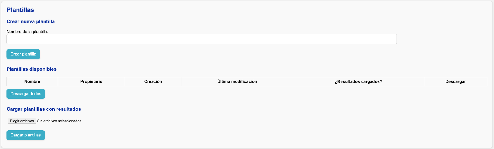

# Cargar resultados

Al final de la sección de plantillas verá un botón para seleccionar y cargar plantillas analizadas:

Una vez cargada la plantilla, el servidor concatena la información contenida en las hojas **Resumen** y **Atípicos** y guarda el resultado, el cual servirá de insumo para análisis posteriores que realice en la app.
