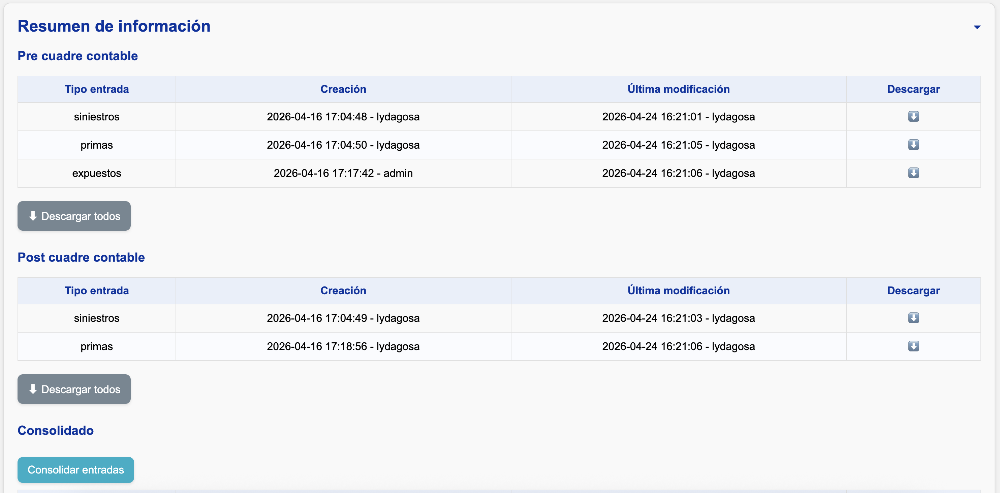

<!--markdownlint-disable MD007-->

# Consolidación de información

En esta etapa, el sistema **unifica y transforma los datos de entrada** para que puedan ser utilizados en las plantillas de Excel.

## ¿Qué información se utiliza?

Depende de si realizó o no el cuadre contable:

- Si realizó cuadre contable:
    - Se utiliza la información después del cuadre
    - Se incluyen también los archivos que no participaron en el cuadre
- Si no realizó cuadre contable:
    - Se utilizan todos los archivos de extracción o carga manual

## ¿Dónde ver los archivos utilizados?

La lista de archivos de entrada se encuentra en:

- Sección **"Resumen de información"**
- Sub-sección **"Consolidado"**

!!! tip
    Puede usar el botón **"Consolidar entradas"** para generar explícitamente los archivos finales. Sin embargo, esto **no es obligatorio**, ya que cualquier función dentro de la plantilla ejecuta automáticamente este proceso.

## Transformaciones adicionales

Los datos se convierten en formato de **triángulos** antes de enviarse a la plantilla.

### Siniestros

- **Triángulos**: se generan bases de triángulos con ocurrencias en las periodicidades especificadas en el [archivo de segmentación](../../config/segmentacion.md).
- **Para entremés**: se generan bases de triángulos con ocurrencias en las periodicidades especificadas en el [archivo de segmentación](../../config/segmentacion.md) y desarrollo mensual, junto con una base mensual para el periodo en curso.

### Primas y expuestos

Se crea una única base con las cuatro periodicidades posibles a partir de los datos mensuales. Para las periodicidades mayores a mensual, los datos se agregan así:

- **Primas:** Suma.
- **Expuestos:** Promedio.
