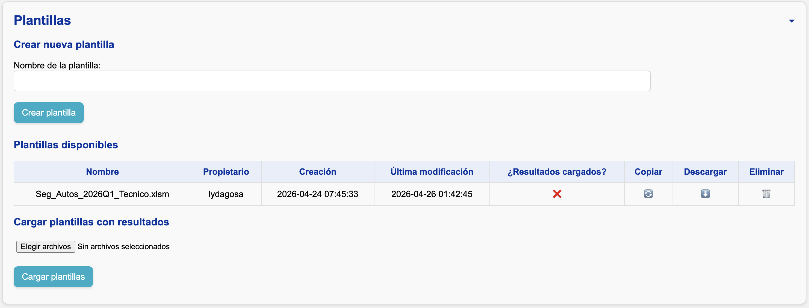
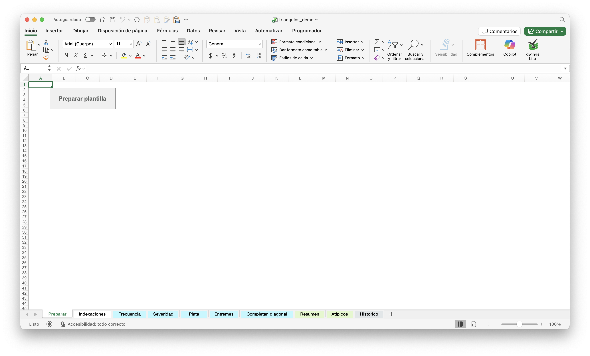

<!--markdownlint-disable MD007-->

# Crear una plantilla

Después de la sección **"Controles y cuadre de información"**, verá la siguiente sección:

## Crear una nueva plantilla

1. Ingrese el nombre de la plantilla.
2. Presione el botón **"Crear plantilla"**.
3. En la tabla de plantillas disponibles, presione el botón ⬇️. Se descargará automáticamente un archivo de Excel:

    

4. Presione el botón **"Preparar plantilla"**.

## ¿Qué hace el botón “Preparar plantilla”?

Este botón inicializa la plantilla para su uso, generando las estructuras necesarias dentro del archivo de Excel.

!!! danger "¡Cuidado!"
    Si prepara una plantilla ya existente, los resultados de la hoja **Resumen** se borrarán. Para recuperalos:

    - Si no ha cargado la plantilla en el servidor, tendrá que usar la función **Traer y guardar** en las hojas correspondientes.
    - Si ya cargó la plantilla, descárguela nuevamente.

    Si sólo desea abrir o revisar una plantilla existente, **no la prepare**.

## Copiar una plantilla existente

Si desea reutilizar una plantilla, presione el botón 🔄 en la columna **"Copiar"** de la tabla de plantillas. Esto creará una nueva plantilla que es una copia exacta del archivo almacenado en el servidor, incluyendo:

- Fórmulas
- Estructura
- Criterios definidos

Esto es útil para:

- Crear variaciones de un análisis
- Probar sensibilidades
- Evitar empezar desde cero un análisis nuevo
