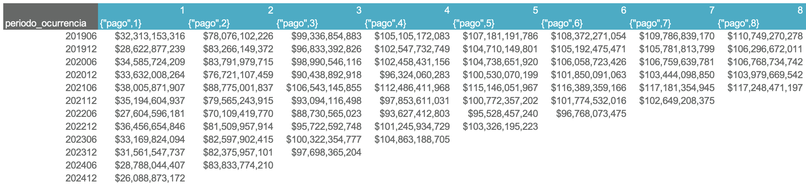
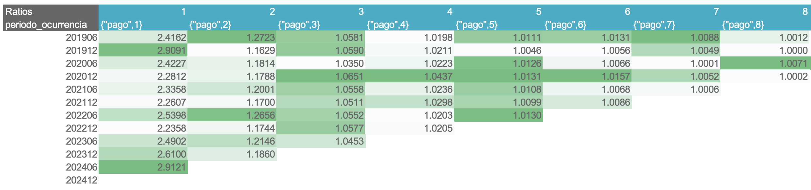
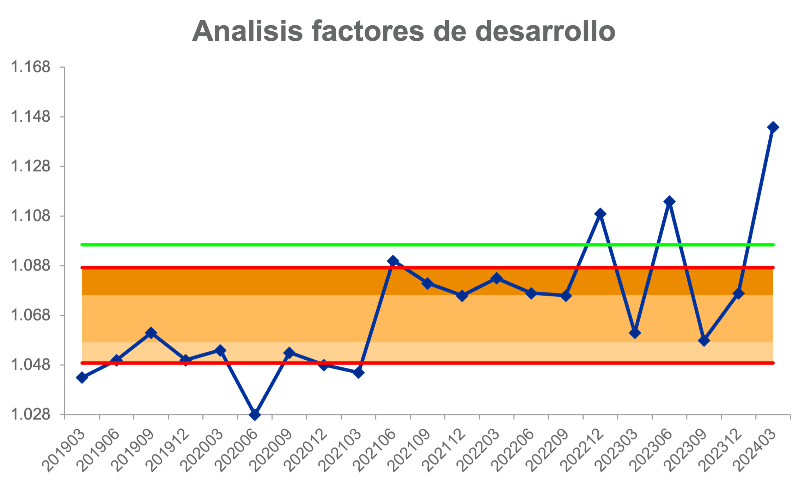
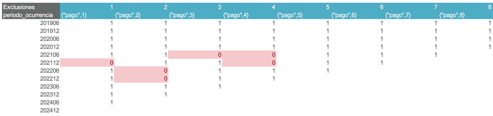
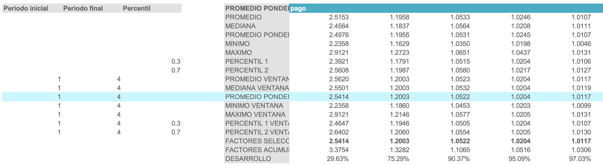
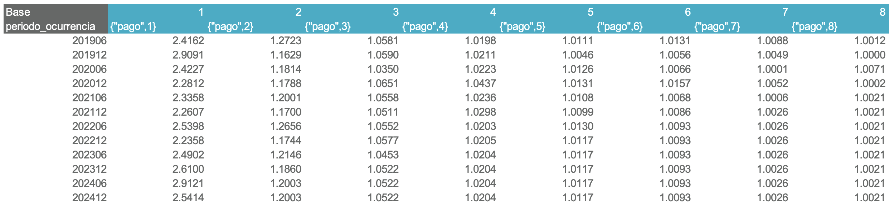
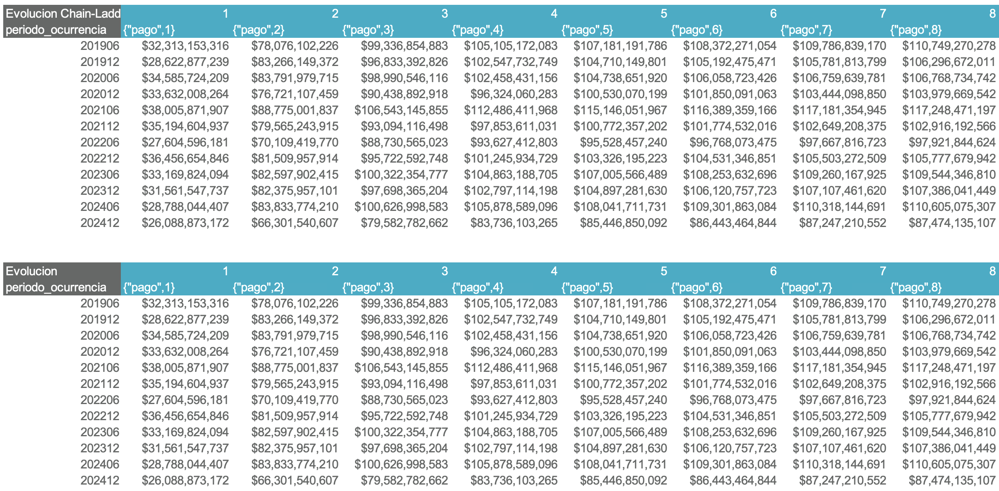
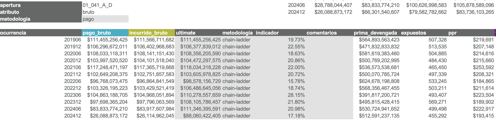
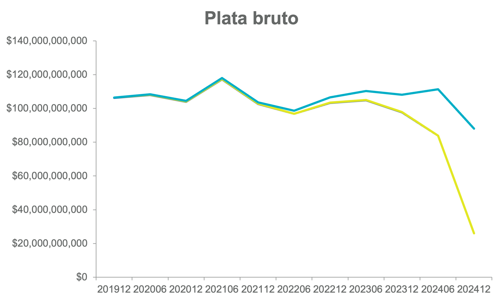

# Analizar triángulos

Existen dos caminos para estimar por triángulos:

1. **Frecuencia y severidad**: Calcula la siniestralidad última como el producto de las dos cantidades.
2. **Plata**: Calcula la siniestralidad última directamente.

El proceso se mostrará con **Plata**, pero es análogo para frecuencia y severidad. Recuerde: la estimación se realiza **apertura por apertura**.

## Botones

En la hoja de análisis, verá la siguiente interfaz:

### Generar hoja

Crea la estructura del análisis para la apertura/atributo seleccionados.

### Cambiar apertura

Actualiza los datos del triángulo al inicio de la plantilla según la apertura/atributo seleccionados, sin modificar el resto de la estructura de la hoja.

### Guardar estimación

Almacena todos los parámetros definidos en la plantilla para la apertura y el atributo seleccionados. Esto incluye:

- Triángulo de exclusiones.
- Ventanas de factores de desarrollo.
- Tipo de factor seleccionado (promedio, mediana, promedio ponderado, etc.).
- Vector de factores seleccionados.

Además, en los casos de Frecuencia, Severidad y Plata, también se guardan:

- Tipo de metodología (pago o incurrido).
- Vector de ultimate (valores y fórmulas).
- Metodología por ocurrencia (Chain-Ladder, Bornhuetter-Ferguson o Indicador).
- Triángulo de factores de desarrollo (por si se decide modificar los factores de una o varias ocurrencias).
- Vector de indicador (relevante solo para metodologías Bornhuetter-Ferguson e Indicador).
- Columna de comentarios.

En el caso de Severidad, si se usa una metodología de indexación se guarda también el triángulo del vector de indexación.

!!! warning "Advertencia"
    La única persona con permiso para realizar esta acción es el **creador de la plantilla**.

### Cambiar apertura y traer estimación

Carga en la plantilla los parámetros almacenados previamente para la apertura y el atributo seleccionados. Es el inverso de la función **Guardar estimación**.

### Guardar varias aperturas

Ejecuta la función **"Guardar estimación"** para todas las aperturas y atributos seleccionados.

### Traer y guardar varias aperturas

1. Prepara plantilla para actualizar los datos de las hojas **Resumen**, **Atípicos**, y **Entremés**.
2. Se ejecutan las funciones **"Cambiar apertura y traer estimación"** y **"Guardar estimación"** para todas las aperturas y atributos seleccionados.

!!! tip
    Esta funcionalidad es útil para actualizar las cifras reales conservando los mismos criterios actuariales de estimación.

### Ajustar gráfica factores

Corrige los ejes cuando cambian periodos o alturas de la gráfica.

## Generar la hoja de análisis

1. Seleccione en el segmentador de datos la **apertura** y el **atributo** deseados.
2. Presione el botón **Generar hoja**.

## Estructura de la hoja de análisis

### Triángulos acumulados

Muestran los pagos (azul) e incurridos (amarillo).

- Cada fila corresponde a una ocurrencia (periodo de ocurrencia del siniestro).
- Cada columna corresponde a una altura (tiempo transcurrido desde la ocurrencia hasta el pago o movimiento).

### Ratios

Aquí se calculan los **factores de desarrollo**, los cuales representan la tasa de evolución de la cifra de pago o incurrido entre una altura y la siguiente.

#### Gráfica de factores

Permite visualizar el comportamiento y la tendencia de los factores de desarrollo en una altura específica.

- La **línea azul** muestra los factores de desarrollo observados para la altura seleccionada en cada periodo de ocurrencia.
- Las **líneas rojas** indican los percentiles 20 y 80.
- Las zonas sombreadas entre estas líneas representan rangos de percentiles: 20–40, 40–60 y 60–80.
- La **línea verde** muestra el factor actualmente seleccionado.

Esta gráfica es dinámica: se actualiza automáticamente al modificar cualquiera de los siguientes parámetros:

- Metodología (pago o incurrido)
- Número de periodos a visualizar
- Altura

!!! tip
    Si la gráfica se descuadra al cambiar parámetros, utilice el botón **Ajustar gráfica factores**.

### Exclusiones

En algunos casos, pueden presentarse factores atípicos debido a condiciones de negocio o fenómenos específicos que alteran su comportamiento respecto al resto de la altura.

- Marque con **0** los factores que desea excluir.
- Los factores a incluir se dejan en **1**.

### Estadísticos

La estrategia clave en el método Chain-Ladder consiste en seleccionar de forma adecuada los factores de desarrollo que se utilizarán  para proyectar los periodos faltantes del triángulo. Para cada altura del triángulo debe definirse un factor de desarrollo específico.

- A la izquierda se definen las **ventanas temporales** asociadas a cada estadístico, las cuales pueden ser modificadas por el usuario.
- El estadístico seleccionado se resalta en **azul claro**, puede modificarse desde la celda ubicada en la primera fila de esta sección.
- Si necesita cambiar manualmente la lógica de una altura específica, edite la fórmula en la fila **“factor seleccionado”**, que es la que se utiliza en el cálculo final del triángulo proyectado.

### Triángulo base

Permite modificar manualmente los factores de desarrollo celda por celda.

!!! tip
    Esto es útil en casos donde, por ejemplo, se quiere seleccionar factores diferentes para una ocurrencia particular.

### Triángulos desarrollados

- **"Evolucion Chain-Ladder"**: Es el triángulo evolucionado con los factores seleccionados.
- **"Evolucion"**: Es el triángulo evolucionado con los factores seleccionados, pero reescala las ocurrencias donde se seleccionó una metodología diferente a Chain-Ladder. Este triángulo representa el resultado final del análisis.

### Tabla resumen

Esta tabla contiene el resultado final del análisis.

- Las celdas con **fondo gris** son **paramétricas**, lo que significa que pueden ser modificadas libremente por el usuario.
- Por defecto, las estimaciones se basan en el **pago**. Para usar el **incurrido**, escriba "incurrido" en la celda superior izquierda.

#### Metodologías disponibles

|Metodología                    |¿Cómo activarla?               |¿En qué consiste?                                         |
|-------------------------------|-------------------------------|----------------------------------------------------------|
|**Chain-Ladder** (por defecto) |Escriba "chain-ladder"         |Estima con factores de desarrollo                         |
|**Indicador**                  |Escriba "indicador"            |Usa un valor esperado o un % sobre la prima devengada     |
|**Bornhuetter-Ferguson**       |Escriba "bornhuetter-ferguson" |Pondera Chain-Ladder e Indicador según el % de desarrollo |

La tabla incluye también columnas de apoyo (**"indicador chain-ladder"**, **"expuestos"**, etc.) y un espacio de **comentarios** para que el usuario registre los criterios, decisiones y justificaciones aplicadas en la estimación de cada ocurrencia.

!!! tip
    Procure no dejar la columna de comentarios vacía. Será útil para usted y para los auditores.

#### Gráfica de ultimate

Muestra una comparación de pago, incurrido, y ultimate para cada periodo de ocurrencia.

## Pasos finales

1. Presione **Guardar estimación**. La siguiente información será almacenada en el servidor:

    - Triángulo de exclusiones.
    - Ventanas de tiempo para estadísticos.
    - Vector de factores seleccionados.
    - Triángulo base.
    - Metodología (pago o incurrido).
    - Ultimate por ocurrencia.
    - Metodología por ocurrencia.
    - Indicador por ocurrencia.
    - Comentarios.

2. Para analizar una nueva apertura:

    - **Desde cero**: seleccione la apertura en la lista desplegable y presione **Generar hoja**. Esto cargará la configuración por defecto.
    - **Manteniendo los parámetros y criterios actuales**: seleccione la apertura en la lista desplegable y presione **Cambiar apertura**. Esto conserva la configuración vigente como punto de partida.

## Modificar un análisis ya guardado

1. Seleccione la apertura y el atributo correspondientes desde el segmentador.
2. Presione **Cambiar apertura y traer estimación** para cargar los datos almacenados.
3. Haga las modificaciones necesarias.
4. Presione **Guardar estimación** para actualizar los resultados almacenados.
