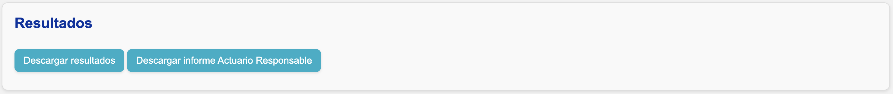
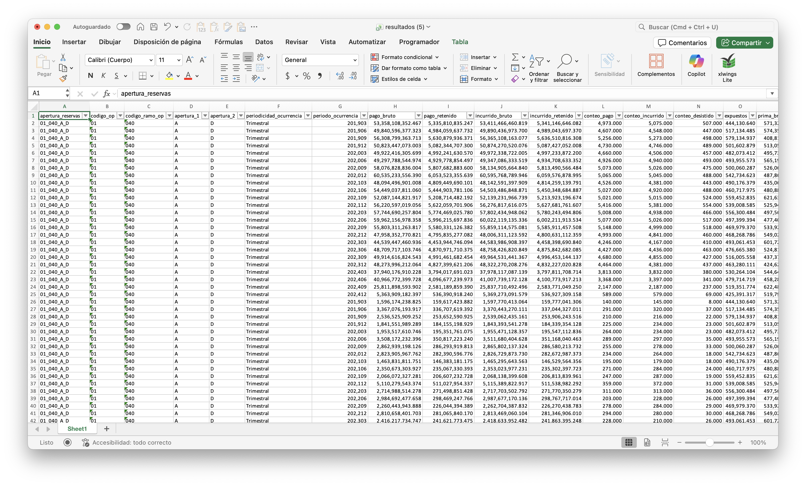
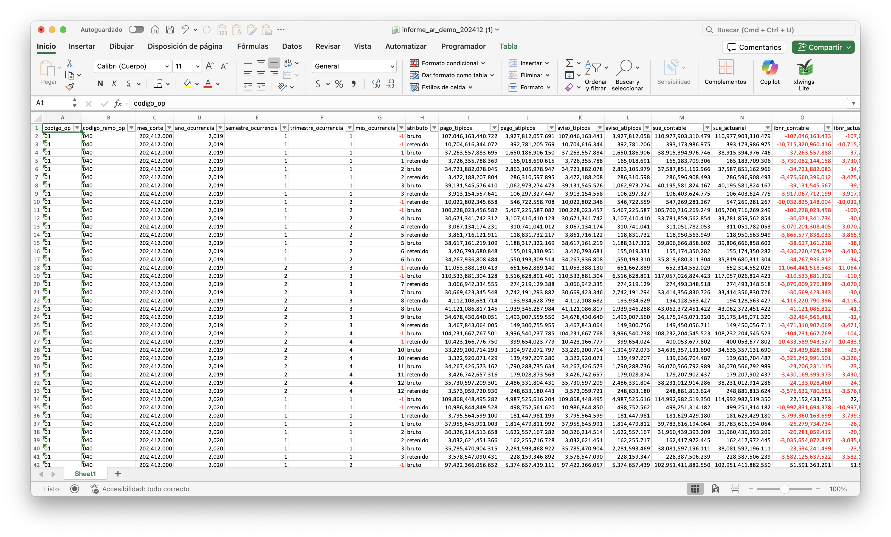

# Resultados e informes

Después de la sección **"Plantilla"**, verá la siguiente sección:

## Consolidación de resultados

El botón **Descargar resultados** reúne todos los resultados de análisis históricos que haya realizado en la aplicación y la entrega dentro de un archivo de Excel.

!!! warning "Resultados duplicados"
    En caso de que existan análisis que contengan múltiples plantillas con resultados de la misma apertura, el sistema conservará **sólo la estimación más reciente**. Las demás serán ignoradas.

## Generación de informes

### Informe Actuario Responsable

El botón **Descargar informe Actuario Responsable** genera este informe y lo entrega dentro de un archivo de Excel.

